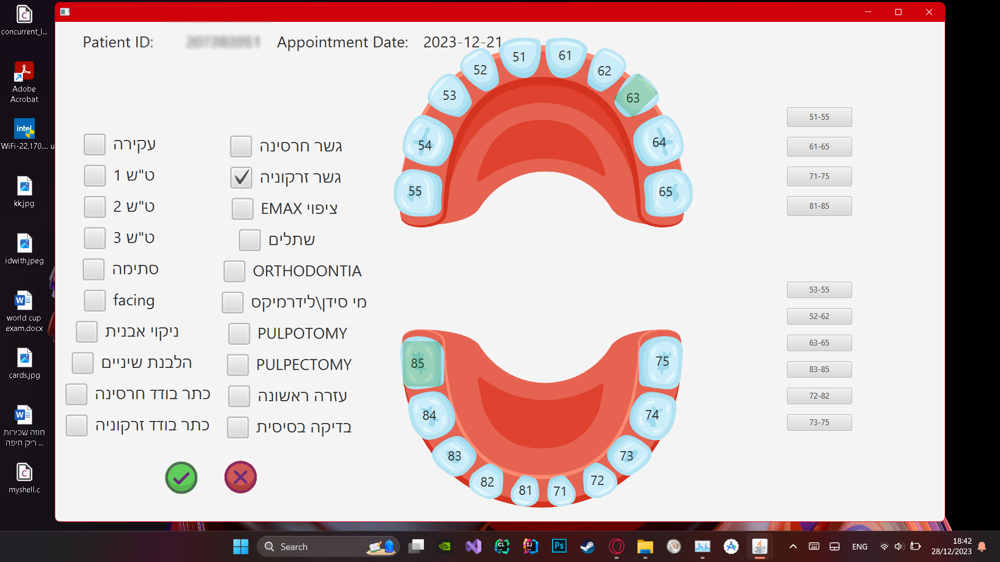

# DentalClinicManager
Dental Clinic  Manager desktop app for Dental Clinics in Israel.

using javafx gui as frontend and AWS S3 as backend - objects are json files.
each clinic has its own bucket.

the code is private so wont upload it here .

screenshots of the software : 

